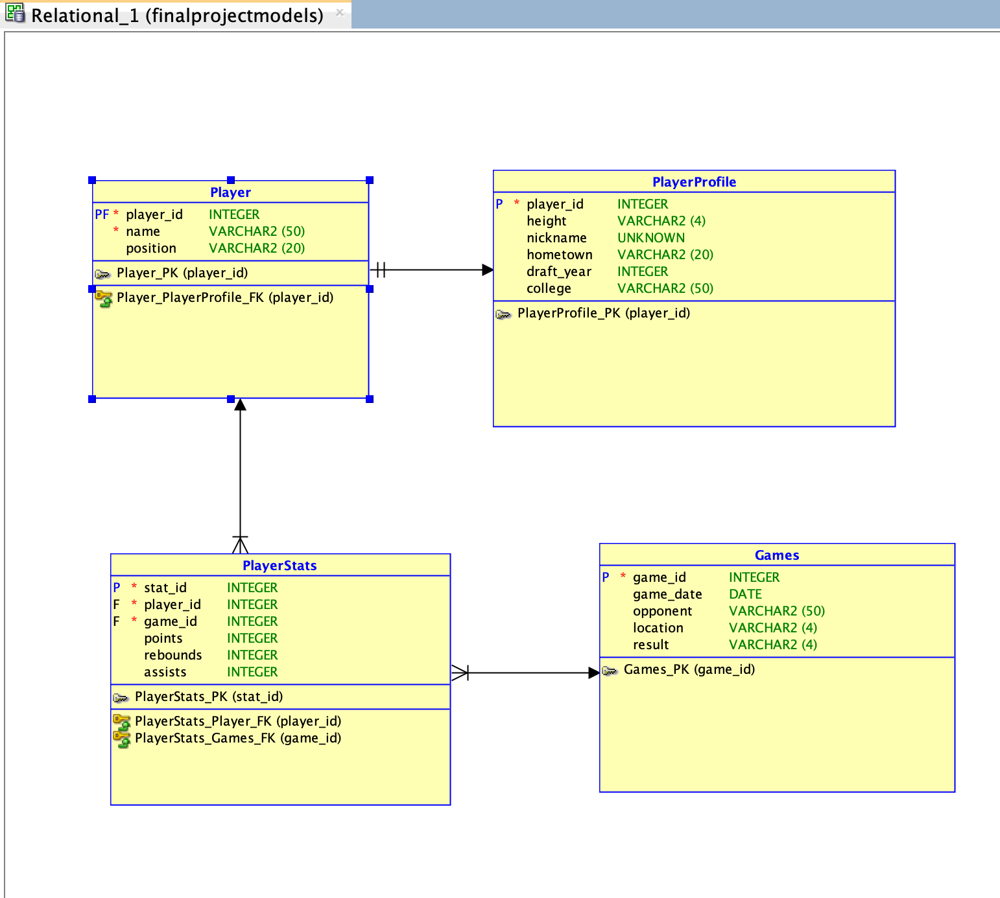

# Timberwolves Basketball Database Project

## Project Overview
This project is a relational database built to track and analyze player performance for the Minnesota Timberwolves, focusing on key database management principles such as entity relationship modeling, primary and foreign keys, data manipulation, query design, and views. 

The database includes entities for `Player`, `PlayerStats`, `Game`, and `Profile`, allowing comprehensive analysis of players' game performance across the season. This project demonstrates practical database design and query capabilities in a sports analytics context.

## Entity-Relationship (ER) Diagram
The ER diagram shows the relationships between the entities used in the database.



## Database Tables

### Player
- **Primary Key:** `player_id`
- **Attributes:** `name`, `position`

### Game
- **Primary Key:** `game_id`
- **Attributes:** `game_date`, `opponent`, `location`, `result`

### PlayerStats
- **Composite Primary Key:** (`player_id`, `game_id`)
- **Foreign Keys:** `player_id` references `Player`, `game_id` references `Game`
- **Attributes:** `points`, `rebounds`, `assists`

### Profile
- **Primary Key:** `player_id`
- **Attributes:** `height`, `nickname`, `hometown`, `draft_year`, `college`

## Example Queries

```sql
-- Show each players name, nickname, and average points from largest to smallest
select name, nickname, round(avg(points), 2) as avg_points
from player
join playerprofile on player.player_id = playerprofile.player_id
join playerstats on player.player_id = playerstats.player_id
group by player.name, playerprofile.nickname
order by avg_points DESC;

-- Select game date, player name, and points for Naz Reid when Anthony Edwards scored less than 15 points
select game_date, name, points
from games
join playerstats on games.game_id = playerstats.game_id
join player on player.player_id = playerstats.player_id
where player.name = 'Naz Reid'
and games.game_id in (
    select game_id
    from playerstats
    join player on playerstats.player_id = player.player_id
    WHERE player.name = 'Anthony Edwards'
    AND playerstats.points < 15 )
;